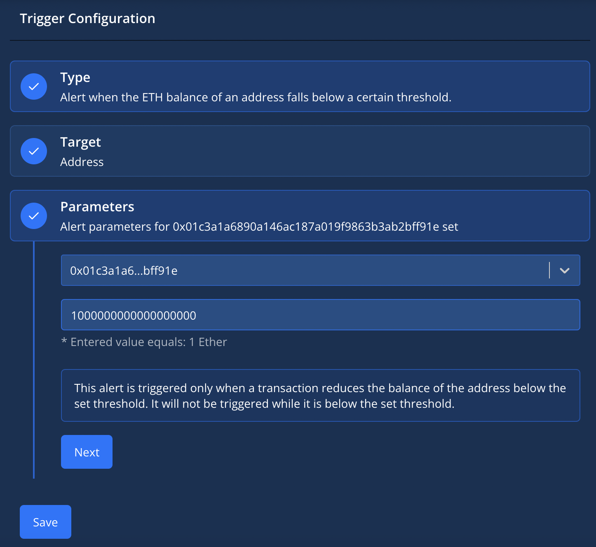

# ETH WARSAW TENDERLY

### Withdraw funds from L2 when there is a risk of Operator stopping commiting a blocks.

Every L2 solution uses Operators - accounts that pay for transactions validation on L1. If this account runs out of funds - your tokens are locked on the L2. To prevent this, we use [Tenderly](https://tenderly.co/) actions that transfers all your ETH to the L1 address when operator is running on low funds. 

## How it works:
- Tenderly provides an alerting system, that we use to look at the balance of L2 Operators and when their balance reaches some value - trigger the needed action.
- The triggered action reaches the desired L2 network and requests a funds withdrawal to the L1.

As an example we used two L2 solutions and implemented a dedicated actions for Goerli network:
- Optimism operator address - **0xf7bAc63fc7CEaCf0589F25454Ecf5C2ce904997c**
- ZKSync operator address - **0x01c3A1a6890A146aC187A019F9863B3Ab2BfF91e**

## How to set up:

```
brew tap tenderly/tenderly && brew install tenderly
```

```
tenderly login
```

Go to `tenderly.yaml` and change `username/project-name` to your username and project name.

Go to the Actions->Secrets tab of https://dashboard.tenderly.co/ and add a secret with `WALLET-KEY` name and your private key as a value.

```
tenderly actions deploy
```

Go to the actions list, pick the needed action and configer a trigger for it. 
The example setup is below:

